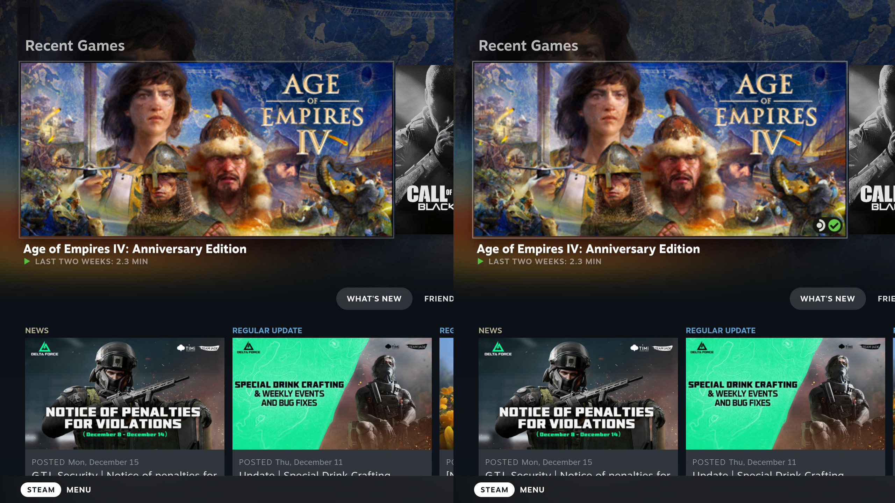
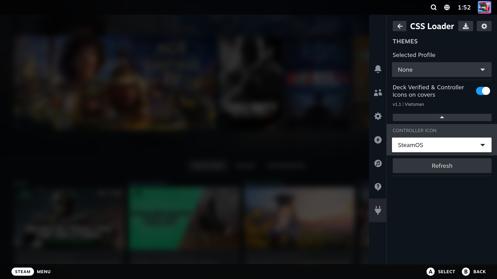

# Deck Verified Badge

A CSS Loader theme for SteamOS that displays the Deck Verified and Controller Support icons on non-Steam games in your library. 

## 📸 Preview

### Before vs After

### Menu

## 📥 Installation

### <s>Method 1: CSS Loader Store (Recommended)
1. Ensure you have [Decky Loader](https://github.com/SteamDeckHomebrew/decky-loader) installed on your Steam Deck.
2. Install the **CSS Loader** plugin from the Decky plugin store.
3. Open the CSS Loader menu, navigate to the Theme Store, and search for **Deck Verified Badge**.
4. Install and enable the theme!</s>

### Method 2: Manual Installation
1. Go to the [Releases](https://github.com/vietsman/deck-verified-badge/releases/latest) page of this repository.
2. Download the latest release [DeckVerifiedBadge-latest.zip](https://github.com/vietsman/deck-verified-badge/releases/download/latest/DeckVerifiedBadge-latest.zip) file.
3. Extract the zip file into your CSS Loader themes directory: `/home/deck/homebrew/themes/`
4. Open the CSS Loader plugin on your Steam Deck, refresh your themes, and toggle it on.

## ⚙️ Options

There are 4 icon styles to choose from:

* **Xbox**
* **PS5 DualSense**
* **PS4 DualShock**
* **SteamOS** (Default)

## 🐛 Issues & Feedback

If you run into any visual bugs or have suggestions for improvements, please feel free to [open an issue](https://github.com/vietsman/deck-verified-badge/issues) on this repository.

## 📜 License

[MIT](LICENSE)

